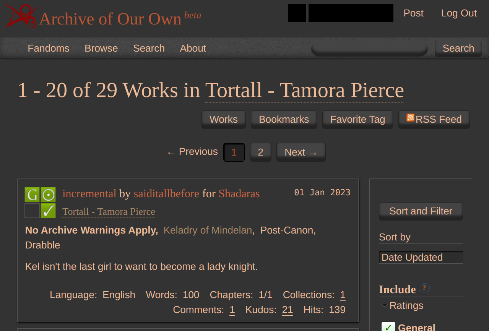

# Miscellaneous AO3 site-skins

All the css files here can be pasted into an [AO3 site skin](https://archiveofourown.org/faq/skins-and-archive-interface#createsiteskin) to achieve their stated purpose.

Personally, I like to have multiple clearly-labeled site skins that each have a single (small) specific purpose, and are marked as "Parent only" (this is a checkbox in the "Advanced" section when you're editing a skin. Then I have one combined site skin that just adds all my others as a parent (on the edit page for a site skin, hit "Add parent skin" and search for the names of your other site skin(s)). That makes it really easy to switch between, say, your regular combined skin, and your combined skin with added "Reversi" for dark mode, without having to change both skins if you decide to tweak something (like copying in something from here).

## Highlight character bashing tags
`highlight-character-bashing.css` attempts to bold and strike-through (like **~~this~~**) any tags that are a synonym of either "Character Bashing" or any of its subtags like "[name of character] Bashing". It is not perfect, missing some tags and catching some irrelevant tags, but I like that it works on mobile and that I don't have to remember to exclude the tag (or can at least make an informed decision as to whether I want to read the work, without skimming over the tag accidentally).

The `text-decoration: line-through;` and `font-weight: bold;` lines are the ones to change if you would like different styling applied to the matched tags.

In case you're curious about my process, I basically tried to match tags that contained a bunch of words or phrases associated with bashing, like "bash" or "critical of" or starting with "fuck", and then had to do some unmatching to get rid of tags like "no bashing" or "fuckbuddies". The matching/unmatching is incredibly janky because English is not designed to be interpreted like this, and I end up basically just going back and forth between tweaking it and looking at the [page of character bashing synonyms](https://archiveofourown.org/tags/Character%20Bashing) or some of its subtag pages to make sure I was catching the tags I wanted to catch, and then browsing through works searches trying to notice what it was highlighting that it shouldn't be and figuring out what I needed to unmatch to make that happen.

The matching/unmatching is achieved by matching against the tag's url, which is why there are `%20`s instead of spaces all over the place. The `[href*="thing to match"i]`s all over the place are [css attribute selectors](https://developer.mozilla.org/en-US/docs/Web/CSS/Attribute_selectors); the `*=` allows matching part of the tag url (the full tag url format usually looks something like `/tags/Blah/works`) and the `i` at the end makes the matching ignore upper/lowercase.

## Force works to be shown with a maximum width
If you add these lines to a site skin, they will force works to be at most 500px wide. (My eyes get tired of how far back and forth they have to move on a monitor compared to a phone.)

```
#workskin {
  max-width: 500px;
  margin: auto;
}
```

Note: even though the code says "workskin" in it, this is intended to be used as or added to a *site* skin.

## Force bigger font but only on mobile
`font-bigger-mobile-only.css` has some custom tweaks I made to get ao3's font a little larger on my phone.

To get it to apply on only your phone, you will need to pick "only screen and (max-width: 42em)" from the "Media:" list in the "Advanced" section of the site skin editor. If you would like to use it with another skin that applies to both phone and desktop, you will need to make this one as a separate skin, and then either (a) add it as a parent of the other skin or (b) make a new skin that has both this skin and your other skin as its parents, and use the new skin.

It is very specific to my current phone and also chrome on android, so I'm not sure it's even useful to anyone else, but at least this way I have it saved for myself.

Off-topic but I'm fairly certain there is some sort of bug in how mobile chrome decide the font size on certain elements, because for example sometimes the relationship tags on a work page are smaller than the other tags for literally no reason. The text of a work will also sometimes show much larger than usual for a second when the page first loads. This skin *does not fix this issue*, just fights with it in weird ways sometimes.

## Make menu dropdowns narrower

Normally menu dropdowns (e.g. the one under "Hi Username!") are rather wide, which can cause the text to be hidden off-screen on mobile. This snippet, added to a site skin, will limit dropdowns to the text width instead. If you wish to only apply this on mobile, pick "only screen and (max-width: 42em)" from the "Media:" list in the "Advanced" section of the site skin editor. If you want other things in your site skin to apply on both mobile and desktop, one skin will need to be set as the parent of the other so that the two skins can have different media settings.

```
#header .menu {
  width: unset;
}
```

## Reversi correction

To use this site skin, create a new site skin with the contents of `reversi-corrected.css` as the css, and set the public "Reversi" skin as the parent.

The intention of this skin is to fix a bug in the Reversi skin: with the original Reversi skin, when you hover over links that you've previously visited they often have black text on a dark background and thus look pretty much invisible. This skin attempts to preserve everything about Reversi except to make that text stay gray instead of going black.

If you're still seeing black text where you shouldn't, or text that should be black is now gray, let me know specifically where you see that happening and I can try to fix it!

## Red-tinted Reversi

This is based on the public [Reversi](https://archiveofourown.org/skins/929) site skin, but it's more red-tinted. Use the css in `reversi-replacement.css` if you would like to try it out. It's supposed to be a full replacement of reversi, but I personally set "Reversi" as its parent skin just in case, as falling through to Reversi if something is unspecified is probably better than falling through to the regular archive skin.

